# FOOD ORDERING SYSTEM:

This streamlined system ensures that both customers and administrators have an easy-to-use interface for managing the food ordering process.

I developed this project while learning the fundamentals of PHP during a course on Udemy.

##### Client Side:

This project is designed for food ordering system, where customers can browse and select their preferred meals through the following features:

- Browse by Category: Customers can filter foods by specific categories.

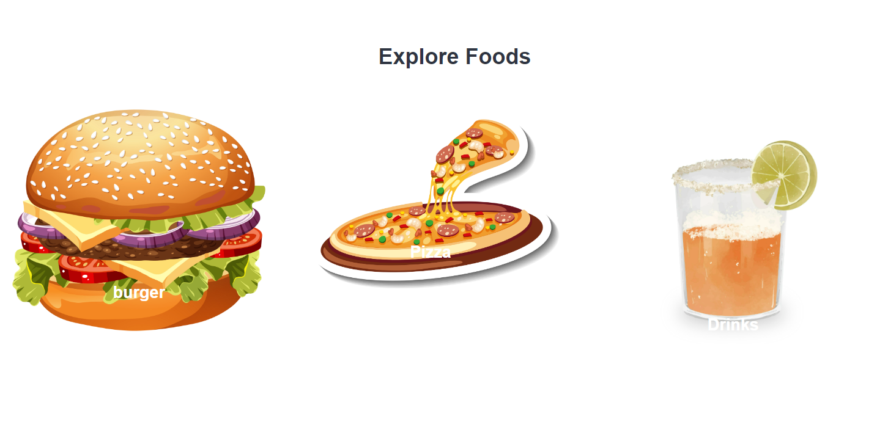

- Search Functionality: A search bar is provided for users to find specific food items by name.

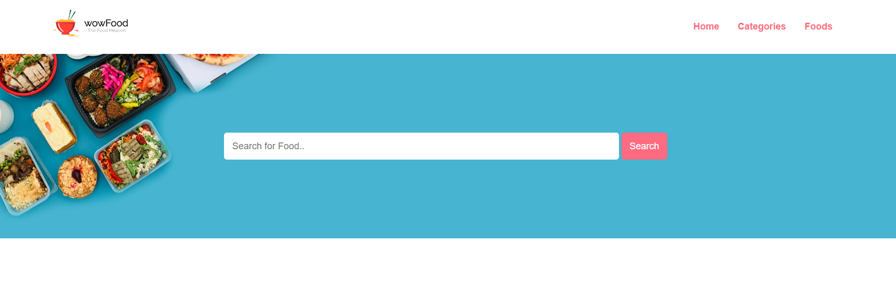

- Menu View: Customers can access the full menu to explore all available options.

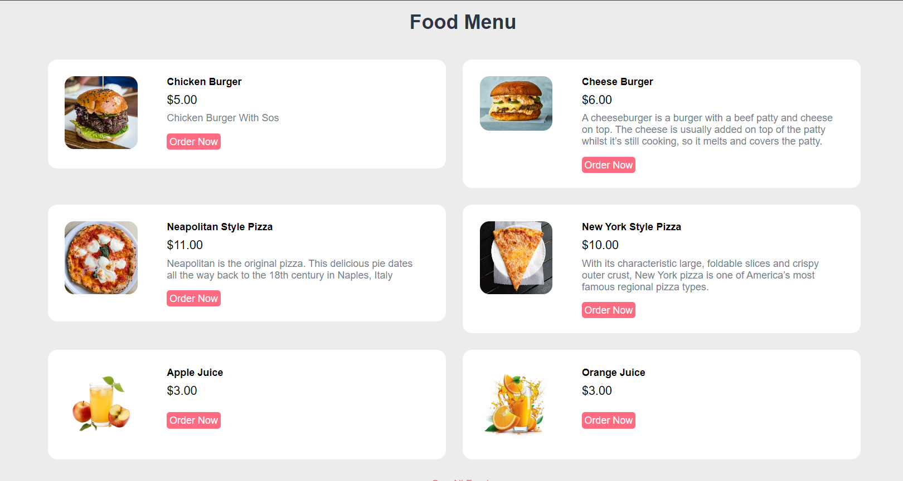

Home Page: Once a customer selects a food item, they can click the "Order Now" button to initiate the order process. A form will appear for the customer to fill out and complete their order, which is then submitted to the admin for processing.
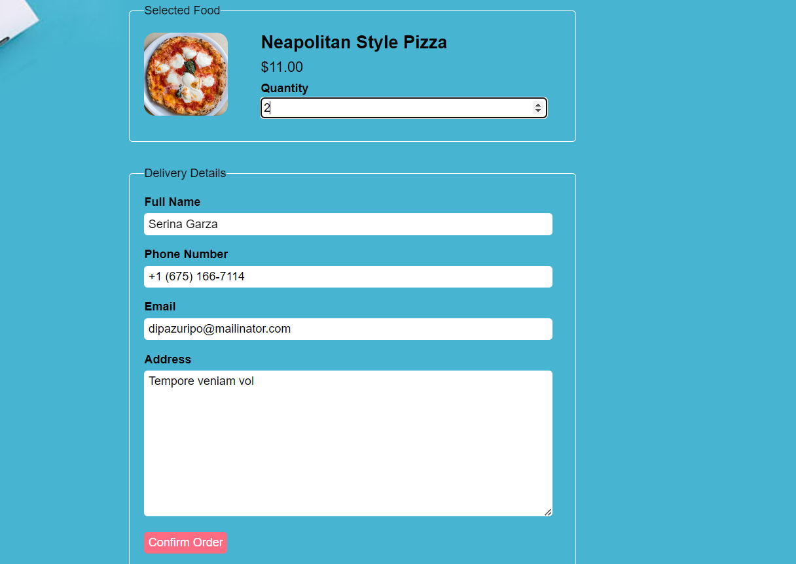

##### Admin Side:

The admin section includes a secure login page that restricts access to the admin panel. Only authenticated users can view and manage the administrative interface.

Upon successful login, the admin is redirected to the admin panel, which includes the following sections:

1. Dashboard:

- Displays the number of food categories.
- Shows the total number of food items.
- Provides an overview of total orders.
- Displays revenue generated (from delivered orders only).

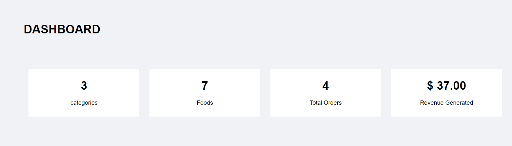

2. Category Management:

- Admins can view all available categories.
- Ability to add, update, or delete categories.

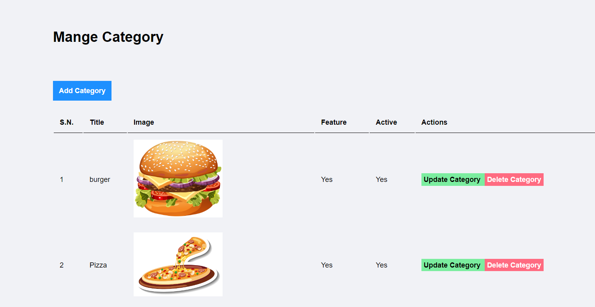

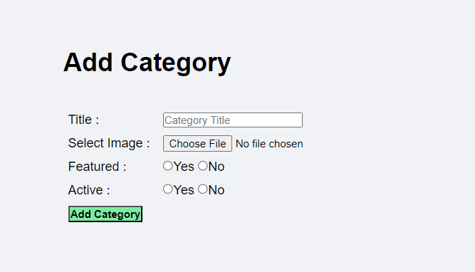 3. Food Management:

- Admins can manage food items, with options to add, update, or delete specific foods.

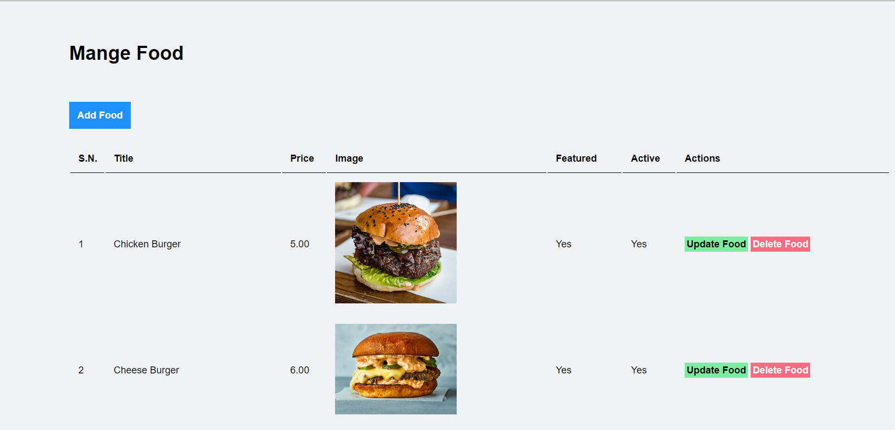

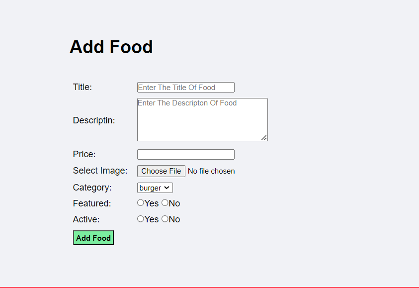 4. Order Management:

- Admins can view and manage all order details, including the status and progress of each order.

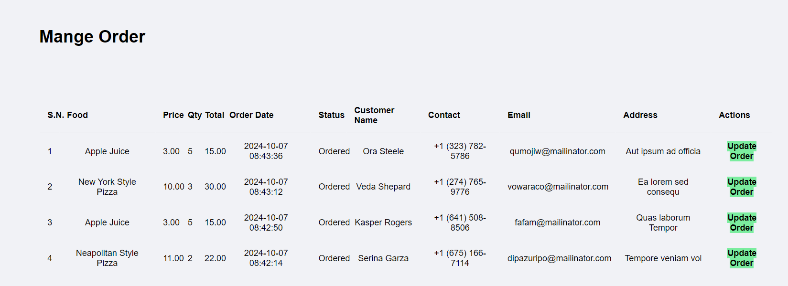

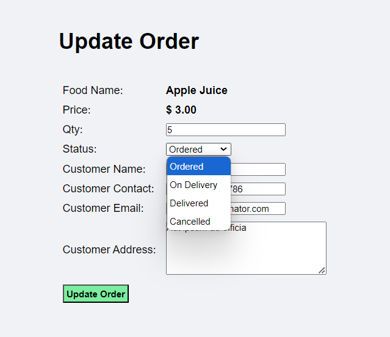
